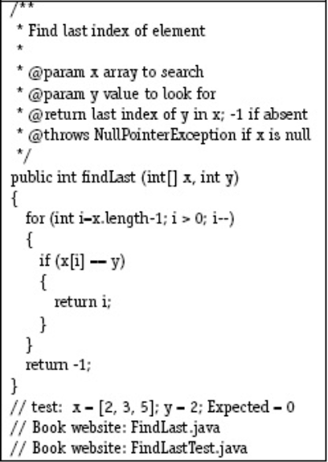
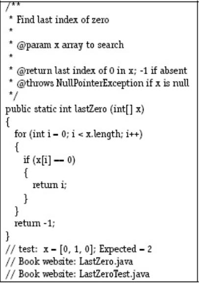
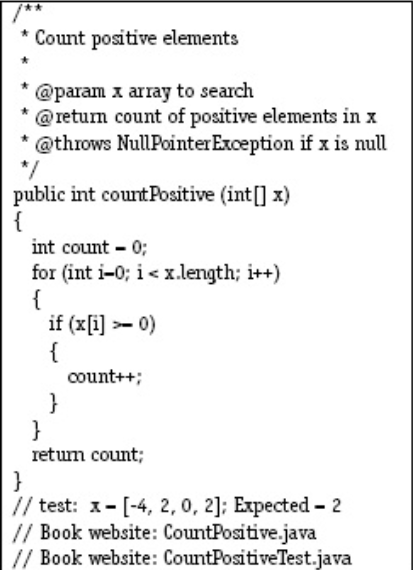
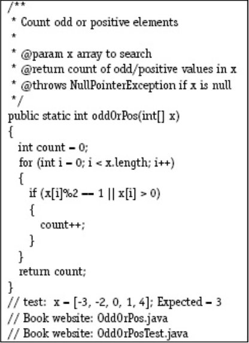

# Chapter 1-5
## Case 1


**a, Explain what is wrong with the given code. Describe the fault precisely by proposing a modification to the code.**

Hàm ```findLast()``` không xét phần tử đầu của mảng (```i``` không bao giờ chạm đến số 0). Cách xử lý: thay ```i > 0``` thành ```i >= 0```

**b, If possible, give a test case that does not execute the fault. If not, briefly explain why not.**

Để code không xử lý vòng lặp ```for``` ở trên, mình có thể truyền vào mảng ```x``` giá trị ```Null```. Khi vòng ```for``` bắt đầu chạy thì sẽ ném ra lỗi NullPointerException.
```
Input: x = Null, y = 1
Expected Output: NullPointerException
```

**c, If possible, give a test case that executes the fault, but does not result in an error state. If not, briefly explain why not.**

Mình có thể lấy ngay test mà đề bài cho sẵn, với một chút biến đổi:
```
Input: x = [2, 3, 5], y = 5
Expected Output: 1
```

Vì ```i``` chỉ giảm tới ```2``` là dừng (bởi điều kiện đã được thỏa mãn), nên lỗi của đoạn code trên chưa thể phát hiện được.

**d, If possible, give  a  test  case  that  results  in  an  error,  but not a failure. If not, briefly explain why not. Hint: Don’t forget aboutthe program counter.**

Vẫn có thể dùng test mà đề bài cho, với chút biến đổi: 
```
Input: x = [2, 3, 5], y = 6
Expected Output: -1
```

Đoạn code vẫn làm đúng chức năng của nó, và nó vẫn trả về lỗi vì không tìm được giá trị ```y``` trong mảng ```x```, nhưng đây không phải là failure.

**e, For the given test case, describe the first error state. Be sure todescribe the complete state.**
```
Input: x = [2, 3, 5], y = 2
Expected Output: 0
Output: -1
First error state:
    x = [2, 3, 5]
    y = 2
    i = 0
    PC: trước đoạn return -1
```

**f, Implement  your  repair  and  verify  that  the  given  test  nowproduces the expected output. Submit a screen printout or otherevidence that your new program works.** 

Đã đề xuất ở câu a

## Case 2


**a, Explain what is wrong with the given code. Describe the fault precisely by proposing a modification to the code.**

Vòng lặp ```for``` phải cho ```i``` xuất phát từ cuối mảng lên đầu mảng, không phải từ đầu mảng đến cuối mảng, vì thế sẽ lệch so với điều kiện của đề bài. Giải pháp: ```for (int i = x.length - 1; i >= 0; i--)```

**b, If possible, give a test case that does not execute the fault. If not, briefly explain why not.**

Không có test case nào mà fault trên không được chạy, vì với mọi test case thì ```i = 0``` đã được khởi tạo rồi.

**c, If possible, give a test case that executes the fault, but does not result in an error state. If not, briefly explain why not.**

Với trường hợp mảng chỉ có duy nhất một phần tử thì đoạn code trên sẽ thi hành đúng với test case:
```
Input: x = [0]
Expected Output: 1
```

**d, If possible, give  a  test  case  that  results  in  an  error,  but not a failure. If not, briefly explain why not. Hint: Don’t forget aboutthe program counter.**

Với những trường hợp như trong mảng ```x``` không có phần tử ```0```, hoặc trong mảng ```x``` phần tử ```0``` được nằm chính giữa mảng, thì đoạn code lỗi vẫn được lặp và thực thi, nhưng kết quả trả về vẫn đúng như dự kiến:
```
Input: x = [1, 2, 3]
Expected Output: -1
```

**e, For the given test case, describe the first error state. Be sure todescribe the complete state.**

Lỗi sẽ được phát hiện ngay ở vòng lặp đầu tiên mà ```i = 0```:
```
Input: x = [0, 2, 3, 0]
Expected Output: 3
Actual Output: 0
First error state:
       x = [0, 2, 3, 0]
       i = 0
       PC: ngay sau khi khởi tạo biến i = 0
```

**f, Implement  your  repair  and  verify  that  the  given  test  nowproduces the expected output. Submit a screen printout or otherevidence that your new program works.** 

*Đề xuất như ở câu a*: ```for (int i = x.length - 1; i >= 0; i--)```

## Case 3


**a, Explain what is wrong with the given code. Describe the fault precisely by proposing a modification to the code.**

Dòng ```if (x[i] >= 0)``` là nguyên nhân gây lỗi, vì mục đích của đoạn code là đếm các phần tử dương, không bao gồm số 0. Giải pháp: sửa thành ```if (x[i] > 0)```.

**b, If possible, give a test case that does not execute the fault. If not, briefly explain why not.**

Để cho câu điều kiện lỗi không được thực thi, thì mảng ```x``` phải là mảng rỗng hoặc ```null``` (chặn không cho vòng lặp xử lí phần thân).
```
Input: x = []
Expected Output: 0
```

**c, If possible, give a test case that executes the fault, but does not result in an error state. If not, briefly explain why not.**

Chỉ cần mảng ```x``` không chứa số ```0``` thì cho dù code lỗi, nó vẫn sẽ cho ra kết quả đúng:
```
Input: x = [1, 2, 3]
Expected Output: 3
```

**d, If possible, give  a  test  case  that  results  in  an  error,  but not a failure. If not, briefly explain why not. Hint: Don’t forget aboutthe program counter.**
  
Tất cả các test case mà phát hiện được lỗi của đoạn code đều cho ra kết quả sai (failure)

**e, For the given test case, describe the first error state. Be sure todescribe the complete state.**

Lỗi sẽ được phát hiện khi mảng ```x``` có chứa số ```0```:
```
Input: x = [0, 2, 3, 0]
Expected Output: 2
Actual Output: 4
First error state:
     x = [0, 2, 3, 0]
     i = 0
     PC: ở đoạn câu lệnh điều kiện if (trước dòng count++)
```

**f, Implement  your  repair  and  verify  that  the  given  test  nowproduces the expected output. Submit a screen printout or otherevidence that your new program works.** 

*Đề xuất như ở câu a*: ```if (x[i] > 0)```

## Case 4


**a, Explain what is wrong with the given code. Describe the fault precisely by proposing a modification to the code.**

Đoạn code lỗi ở câu điều kiện ```if (x[i] % 2 == 1 || x[i] > 0)```. Điều kiện ```x[i] % 2 == 1``` chỉ kiểm tra những số chẵn mà dương, chứ không tính những số chẵn mà âm. Giải pháp: thêm một điều kiện nữa: 
```if (x[i] % 2 == 1 || x[i] % 2 == -1 || x[i] > 0)```
hoặc là sửa lại điều kiện: chỉ kiểm tra số chẵn mà âm, vì nếu số chẵn mà dương thì nó đã dương sẵn rồi, không ảnh hưởng tới mục đích của đoạn code:
```if (x[i] % 2 == -1 || x[i] > 0)```

**b, If possible, give a test case that does not execute the fault. If not, briefly explain why not.**

Giống các câu phía trên, để câu điều kiện (đoạn code lỗi) không được thực thi thì vòng lặp for phải kết thúc trước khi xử lí phần thân, nghĩa là mảng ```x``` phải rỗng hoặc ```null```:
```
Input: x = null
Expected Output: 0
```

**c, If possible, give a test case that executes the fault, but does not result in an error state. If not, briefly explain why not.**

Tất cả các test case mà mảng ```x``` chỉ chứa các phần tử dương thì đoạn code lỗi vẫn luôn được thực thi, nhưng kết quả cho ra vẫn đúng như dự đoán: 
```
Input: x = [1, 2, 3]
Expected Output: 3
```

 **d, If possible, give  a  test  case  that  results  in  an  error,  but not a failure. If not, briefly explain why not. Hint: Don’t forget aboutthe program counter.**

Tất cả các test case mà phát hiện được lỗi của đoạn code đều cho ra kết quả sai (failure)

**e, For the given test case, describe the first error state. Be sure todescribe the complete state.**
Lỗi sẽ được phát hiện khi mảng ```x``` có chứa số chẵn âm:
```
Input: x = [-3, -2, 0, 2, 3]
Expected Output: 4
Actual Output: 3
First error state:
      x = [-3, -2, 0, 2, 3]
      i = 1
      PC: ở đoạn câu lệnh điều kiện if (trước dòng count++)
```

**f, Implement  your  repair  and  verify  that  the  given  test  nowproduces the expected output. Submit a screen printout or otherevidence that your new program works.** 

*Đề xuất như ở câu a*